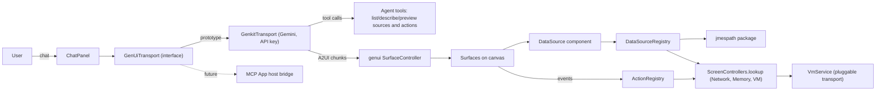

<!--
Copyright 2026 The Flutter Authors
Use of this source code is governed by a BSD-style license that can be
found in the LICENSE file or at https://developers.google.com/open-source/licenses/bsd.
-->
# GenUI in DevTools: agreed design (from the grill-me session)

## Goal
A flagged DevTools screen where the user chats with an agent that builds custom DevTools views out of DevTools components, rendered via A2UI with `package:genui`. The first build is an embedded prototype. The long-term target is deploying it as an **MCP App**, with the host's LLM driving the chat and DevTools acting as the renderer.

## Decisions

| # | Topic | Decision |
|---|---|---|
| 1 | Agent hosting | Pluggable transport. Prototype: embedded LLM client. Future: MCP App mode, where the host agent emits A2UI and DevTools renders it. |
| 2 | Catalog granularity | Two tiers. **Tier 1**: generic JSON-configurable primitives (JsonTable/TreeTable, time-series chart, key-value, later flame chart, treemap, code view) wrapping existing widgets. **Tier 2**: a few composites that reuse the actual screen panes (e.g. `NetworkRequestInspector`). |
| 3 | Data binding | Hybrid: **named, typed, live data sources** wrapping existing controllers, plus a **string expression transform layer**. |
| 4 | Where sources run | Always in the DevTools client. The **VmService transport is a pluggable seam** (direct WebSocket now; a JSON-RPC tunnel over MCP tools later, *not built now*). |
| 5 | Controller reuse | Share the registered controllers via `ScreenControllers.lookup<T>()`. Data sources are thin adapters. Refactor a controller only where its UI state blocks reuse. |
| 6 | Typed ↔ JSON | Sources emit `Map` rows plus an opaque `_ref` handle. A generic `JsonColumnData extends ColumnData<Map>` has format enums (bytes, duration, timestamp, percent, number, string) that reuse existing formatters. Screens' columns can be exposed as named presets. |
| 7 | Binding syntax | A non-visual **`DataSource` catalog component** `{source, params, expression, targetPath}` writes live results into the DataModel. Visual components use standard A2UI path bindings. Params can be path-bound, which enables master/detail. This is pure A2UI, so it needs no protocol extension. |
| 8 | Transform language | **JMESPath**, fully implemented in pure Dart and verified against the official compliance suite. Lives in a new standalone package in this repo with `publish_to: none`. |
| 9 | Agent discovery | **Tools only**: `listDataSources`, `describeDataSource`, `previewDataSource(source, params, expression, limit)` (plus `listActions`/`describeAction`). The system prompt stays small. These map one-to-one to MCP tools later. |
| 10 | Actions | A **named action registry** mirroring data sources (`network.toggleRecording`, `network.clear`, `memory.gc`, `memory.takeSnapshot`, `app.hotReload`, `serviceExtension.set`, …). Runs client-side from A2UI events and reuses controller methods. App-mutating actions require confirmation. Results can be written to a DataModel path. |
| 11 | Placement / persistence | A new `GenUiScreen` behind an "Enable GenUI" toggle in Settings > Experimental features (originally a `FeatureFlags.genUi` flag). Layout: canvas plus a collapsible chat side panel. Screens can be saved/loaded as A2UI JSON specs (components + bindings, no data) and replayed without the LLM. |
| 12 | Dependencies | Depend on `genui` directly: bump `intl` to ^0.20 and accept the media plugin deps. All genui imports stay inside `screens/genui/`. The report records the dependency/g3 cost and the `a2ui_core`-only fallback. |
| 13 | LLM client | **`genkit` + `genkit_google_genai`** with a user-supplied API key (dart-define or settings). Genkit's auth options come later. A pure-Dart genkit could also later run in the DevTools server. |
| 14 | Code location | **Centralized** in `screens/genui/`. It reaches into screen controllers. Tier-2 composites reuse the screen widgets, and any generalization is made in the shared widget itself (no forks). |

## Architecture

## Prototype scope (vertical slice)
- `packages/jmespath` (pure Dart, `publish_to: none`) with the compliance test suite.
- `screens/genui/`: screen, feature flag, chat panel, genkit transport, catalog (Tier-1: `JsonTable`, `TimeSeriesChart`, `KeyValue`; Tier-2: `NetworkRequestDetails`), `DataSource` component, registries, agent tools, save/load of specs.
- Domains:
  - **network**: `network.httpRequests` → table; selecting a row's `_ref` → request inspector composite; actions `toggleRecording` / `clear`.
  - **memory**: heap usage time series → chart; `memory.gc` action (confirmed).
  - **vm**: `vm.info`, `vm.isolates` → key-value / table.
- Unit tests: JMESPath compliance, registries, projection and `_ref` resolution, DataSource component binding.
- **Feasibility report**: architecture, decisions, risks (deps/g3, LLM reliability, perf of large JSON in DataModel, CSP in MCP App mode), assessment of heavier composites (flame chart, inspector tree, timeline), and the MCP App path (tunnelled VmService, tools-as-MCP-tools, spec replay).

## Open risks to validate in the prototype
- `intl` bump and `genui` transitive deps across the DevTools workspace and g3.
- DataModel performance when large lists (thousands of requests) are rewritten on each update. May need throttling or diffing in the DataSource component.
- Whether genkit_google_genai streaming plus tool calling works cleanly in Flutter web (and wasm).
- How reliably the LLM writes JMESPath without seeing a schema up front (mitigated by `previewDataSource`).
