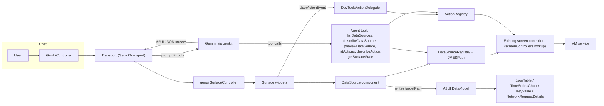

<!--
Copyright 2026 The Flutter Authors
Use of this source code is governed by a BSD-style license that can be
found in the LICENSE file or at https://developers.google.com/open-source/licenses/bsd.
-->
# GenUI in DevTools: Feasibility Report

## Verdict

**It's feasible.** A vertical-slice prototype runs end to end: a chat panel, an LLM that generates A2UI surfaces, live VM-service data bound into existing DevTools widgets, client-side actions, and saving/loading specs. The slice covers the network, memory and VM domains. It needed **one small refactor** to existing screen code. It's fully unit tested (39 GenUI tests, plus 924 JMESPath tests).

The main costs are **dependencies** (genui pulls media plugins, and intl had to move to ^0.20), plus two open questions: **genkit on web/wasm** is unverified, and the prototype needs an **API key in the browser**. Neither blocks the design. Both go away with the MCP App hosting path.

> [!NOTE]
> Design decisions come from the approved [design doc](design.md). This report covers what we learned while building the prototype.

## Architecture

**The data flow:** the agent finds data sources through tools and previews them, then emits a surface. That surface holds a non-visual `DataSource` component, `{source, params, expression, targetPath}`. At runtime the component subscribes to a live stream from the registry. The registry wraps an existing controller, applies the JMESPath transform, and writes the result into the A2UI data model. Visual components bind to that path.

### File map (`packages/devtools_app/lib/src/screens/genui/`)

| Area | Files |
|---|---|
| Data layer | [data_source.dart](../../packages/devtools_app/lib/src/screens/genui/data/data_source.dart), [actions.dart](../../packages/devtools_app/lib/src/screens/genui/data/actions.dart), [ref_store.dart](../../packages/devtools_app/lib/src/screens/genui/data/ref_store.dart), [json_utils.dart](../../packages/devtools_app/lib/src/screens/genui/data/json_utils.dart) |
| Sources/actions | [network_sources.dart](../../packages/devtools_app/lib/src/screens/genui/sources/network_sources.dart), [memory_sources.dart](../../packages/devtools_app/lib/src/screens/genui/sources/memory_sources.dart), [vm_sources.dart](../../packages/devtools_app/lib/src/screens/genui/sources/vm_sources.dart), [default_registries.dart](../../packages/devtools_app/lib/src/screens/genui/sources/default_registries.dart) |
| Catalog | [devtools_catalog.dart](../../packages/devtools_app/lib/src/screens/genui/catalog/devtools_catalog.dart), [data_source_item.dart](../../packages/devtools_app/lib/src/screens/genui/catalog/data_source_item.dart), [json_table_item.dart](../../packages/devtools_app/lib/src/screens/genui/catalog/json_table_item.dart), [json_column_data.dart](../../packages/devtools_app/lib/src/screens/genui/catalog/json_column_data.dart), [time_series_chart_item.dart](../../packages/devtools_app/lib/src/screens/genui/catalog/time_series_chart_item.dart), [key_value_item.dart](../../packages/devtools_app/lib/src/screens/genui/catalog/key_value_item.dart), [network_request_details_item.dart](../../packages/devtools_app/lib/src/screens/genui/catalog/network_request_details_item.dart), [action_delegate.dart](../../packages/devtools_app/lib/src/screens/genui/catalog/action_delegate.dart) |
| Agent | [genkit_transport.dart](../../packages/devtools_app/lib/src/screens/genui/agent/genkit_transport.dart), [agent_tools.dart](../../packages/devtools_app/lib/src/screens/genui/agent/agent_tools.dart), [system_prompt.dart](../../packages/devtools_app/lib/src/screens/genui/agent/system_prompt.dart) |
| Seams | [vm_service_channel.dart](../../packages/devtools_app/lib/src/screens/genui/service/vm_service_channel.dart) (the MCP tunnel plugs in here; not implemented) |
| Screen | [genui_screen.dart](../../packages/devtools_app/lib/src/screens/genui/genui_screen.dart), [genui_controller.dart](../../packages/devtools_app/lib/src/screens/genui/genui_controller.dart), [genui_spec.dart](../../packages/devtools_app/lib/src/screens/genui/genui_spec.dart) |

Changes outside the genui directory:

- **Screen registration:** [app.dart](../../packages/devtools_app/lib/src/app.dart), [screen.dart](../../packages/devtools_app/lib/src/shared/framework/screen.dart) (`ScreenMetaData.genUi`), and [feature_flags.dart](../../packages/devtools_app/lib/src/shared/feature_flags.dart) (`FeatureFlags.genUi`).
- **One refactor:** [network_request_inspector.dart](../../packages/devtools_app/lib/src/screens/network/network_request_inspector.dart).
- **New package:** [packages/jmespath](../../packages/jmespath).

## Data binding: options considered

| Option | Pros | Cons | Verdict |
|---|---|---|---|
| **A. LLM calls raw VM-service tools and inlines data into the surface** | No new runtime concepts | Snapshots go stale immediately. Every refresh needs an LLM round-trip, which costs tokens and latency. It can't handle streaming data (network, heap samples). | Rejected |
| **B. Components take raw VM-service RPCs as props** | Maximally general | The LLM would have to learn the VM-service protocol, isolate IDs and object refs. It duplicates the controllers' logic (polling, caching, recording state). Poor safety. | Rejected |
| **C. GraphQL-style schema over DevTools data** | Typed and introspectable | Needs a big schema and resolver layer. Subscriptions add more complexity. It's awkward to express in A2UI JSON. | Too heavy for now; could layer on later |
| **D. Custom DSL** | Tailored | We'd own a language with no training data behind it, so LLMs would get it wrong. | Rejected |
| **E. Client-side functions in A2UI (`FunctionCall`)** | Native to A2UI | Functions are per-value and stateless, with no subscription lifecycle. Fine for formatting; wrong for live sources. | Used only for small formatting |
| **F. Named live data sources + JSON transform language (chosen)** | Reuses existing controllers. It's live and throttled. Discovery goes through tools. The transform is a spec'd language LLMs already know. It works the same whether the source runs locally or behind a tunnel. | Needs a transform engine, and we had to write one (JMESPath). | **Chosen** |

**Transform languages compared:**

- **JMESPath** won: it has a complete formal spec, an official compliance suite, is widely known by LLMs (from the AWS CLI), and is side-effect free.
- **JSONPath** only selects; it can't project.
- **JSONata** is more powerful, but has no Dart implementation and a much larger surface.
- **jq** has no Dart implementation, and embedding it is heavy.

**Prototype lessons:**

- `previewDataSource` (running a source plus an expression once and returning truncated rows) was the key tool for getting JMESPath right. It lets the agent check its query before emitting UI.
- Opaque `_ref` handles let JSON rows point back to real objects, e.g. `NetworkRequest`. Tier-2 composites like `NetworkRequestDetails` resolve them without serializing the whole object graph.
- Errors from sources and expressions are reported back to the agent as `A2uiValidationException`, so it can self-correct. Each distinct error is reported only once.

## Sharing and maintenance

Existing DevTools code reused directly:

| GenUI component | Reuses |
|---|---|
| `JsonTable` | `FlatTable`, `ColumnData`, and the existing formatters (bytes, durations, timestamps) via `JsonColumnFormat` |
| `TimeSeriesChart` | The DevTools `Chart` / `ChartController` |
| `KeyValue` | `VMInfoCard` / `VMInfoList` |
| `NetworkRequestDetails` | The real `NetworkRequestInspector` (all tabs) |
| Data sources | `NetworkController`, `MemoryController`/chart data, VM service manager, and service extensions, all looked up through `screenControllers.lookup<T>()` |

**Only one refactor was needed.** `NetworkRequestInspector` gained an optional `ValueListenable<NetworkRequest?> request` parameter. It defaults to `controller.selectedRequest`, so the Network screen's behavior is unchanged.

That's the pattern to repeat: when a pane is hard-wired to controller *selection state*, add an injectable listenable. The maintenance burden for tier-2 composites is therefore small. A new screen feature shows up in GenUI for free when it lives in a reused widget.

**Maintenance cost** is concentrated in two places:

1. **Data source adapters.** They're about 50–150 lines per domain and depend on controller APIs, so a controller refactor has to update them. Unit tests cover them.
2. **Column presets / catalog schemas**, which describe widgets to the LLM.

## Heavier composites (not prototyped)

| Candidate | Assessment |
|---|---|
| CPU profiler flame chart / call tree | Feasible as tier 2. It's heavily bound to `CpuProfilerController` selection and search state, so it needs the same injectable-listenable refactor, applied more broadly. Medium effort. |
| Inspector widget tree | Harder. It's tied to the inspector service's object-group lifecycle and the selected-widget sync with the app. It's better exposed as an "open in Inspector" action plus a small summary source. |
| Timeline / Perfetto | The Perfetto view is an iframe with its own state, so embedding several copies is risky. Recommend a frame-stats data source (FPS, jank counts) for charts/tables, plus a "jump to Performance" action. |
| Logging | Easy. A `logging.entries` source plus a `JsonTable` preset. |

## Dependency and g3 cost

| Change | Impact |
|---|---|
| `genui ^0.10.3` | Pulls in `audioplayers`, `video_player` (+ `video_player_win`), `url_launcher`, `flutter_markdown_plus`, `uuid`, `genai_primitives`, and `a2ui_core`. The media plugins are unused by us but add plugin registrations (e.g. `GeneratedPluginRegistrant.swift` changed) and third_party work in g3. `audioplayers_linux` also makes the Linux desktop build require the GStreamer dev libraries (`libgstreamer1.0-dev`, `libgstreamer-plugins-base1.0-dev`). |
| `genkit ^0.17`, `genkit_google_genai ^0.4`, `schemantic ^0.2.3` | These are only needed for the embedded-LLM prototype path. Under the MCP App path they drop out. |
| `intl ^0.19 → ^0.20.2` | Required by genui. This is a repo-wide bump that needs checking against g3's pinned intl. |
| `json_schema_builder` | Small, used for catalog/tool schemas. |
| `jmespath` (new workspace package, `publish_to: none`) | Pure Dart with no dependencies. Needs a g3 BUILD file if DevTools is imported there. |

> [!TIP]
> **Fallback if genui's deps are unacceptable:** depend only on `a2ui_core`, the protocol models and data model (no plugins). Then write a slim surface renderer for our own catalog. The catalog items, data layer and agent tools stay unchanged. The rendering glue in genui is only a few hundred lines.

All genui/genkit imports are confined to `screens/genui/`, so the rest of DevTools doesn't depend on them.

## Risks and open issues

| Risk | Severity | Mitigation / status |
|---|---|---|
| **genkit on web/wasm** is unverified; I didn't run `flutter build web` | High | Verify next. If it fails, swap `GenkitTransport` for a thin REST Gemini client (the `Transport` is already pluggable) or go straight to the MCP App path. |
| **API key in the browser** | Medium | Acceptable for an experiment behind a flag. Long term, the MCP App host supplies the model, so no key is needed. genkit auth helpers are another option. |
| **Every `reportError` / UI event triggers an LLM call** (genui routes both to `onSubmit`) | Medium | Deduplicated per distinct error message. Actions are handled client-side by `DevToolsActionDelegate` and don't reach the LLM unless they're unknown. |
| **DataModel performance**: large lists get rewritten on each update | Medium | Updates are throttled to 250 ms, and the LLM is encouraged to project and limit rows with JMESPath. Diffing or paging could come later. |
| **LLM JMESPath reliability** | Low–Med | `previewDataSource` plus errors reported back to the agent. The prompt includes JMESPath examples. |
| **State lost on disconnect**: controllers are disposed | Low | Specs can be exported and reloaded. Could persist the last spec in preferences. |
| **Memory chart only polls when `preferences.memory.showChart` is true** | Low | Documented in the source description. Better: decouple polling from the preference, or have the source force it on while subscribed. |
| **MCP App CSP / `connectDomains`** | Unknown | Relevant only for the MCP App path. VM-service traffic would go through the host tunnel instead of a direct websocket. |

## MCP App path

The prototype is structured so that each part of the MCP App path swaps in without changes to the catalog or data layer:

1. **Transport:** replace `GenkitTransport` with a host-driven transport. In an MCP App, the host's LLM drives the conversation and sends A2UI messages in, e.g. via tool results. `GenUiController` only depends on genui's `Transport` interface.
2. **Agent tools → MCP tools:** `GenUiAgentTool` is plain `{name, description, inputSchema, call}`, so it maps 1:1 onto MCP tool definitions exposed by the app or server.
3. **VM service access:** implement `VmServiceMessageChannel` over the MCP App host bridge, tunnelled through the Dart MCP server's existing VM-service/DTD connection. Data sources run against the tunnelled `VmService` unchanged.
4. **Spec replay:** `surfacesToSpec` / `parseSpec` already round-trip surfaces, so the MCP server could return saved specs as resources.

## Test results

- `packages/jmespath`: **924 tests pass** (the full official compliance suite plus unit tests, zero skips).
- `packages/devtools_app/test/screens/genui`: **39 tests pass**:
  - registries and JMESPath query/error handling
  - catalog schemas and column/format parsing
  - DataSource binding lifecycle
  - end-to-end surface replay (DataSource → KeyValue)
  - `memory.classes` allocation-profile projection and presets
- MCP `analyze_files` shows no issues in new or changed files. Pre-existing unrelated issues (missing generated mocks, fixture apps) remain.

## How to run

1. Run DevTools with experiments enabled, e.g. `--dart-define=enable_experiments=true`, and connect to an app.
2. Open the **GenUI** tab (✨ icon).
3. Paste a Gemini API key into the chat panel.
4. Try prompts like: *"Show a table of network requests over 100ms with a details pane for the selected one"*, *"Chart heap usage and add a GC button"*, *"Show isolate memory and a hot-reload button"*, *"Show the top 25 classes by memory, my project's classes separately, and refresh/GC buttons"*.
5. Use the toolbar to copy a spec to the clipboard, load a spec, or clear surfaces.

> [!NOTE]
> The network and memory sources depend on those screens' controllers being registered. That happens automatically for all screens when DevTools connects to an app.

## Updates after the initial report

- **`memory.classes` data source.** Early use showed the agent could only report total memory. This source adds per-class instance counts and sizes from the VM allocation profile. It reuses the Memory screen's `ProfileRecord` / `HeapClassName` models without touching `ProfilePaneController`. It adds a `memory.refreshClasses` action and a `memory.classes` table preset. This was about 150 lines plus tests, which supports the claim that new domains are cheap to add.
- **Flutter web app fix, unrelated to GenUI.** For Flutter web apps, DWDS's `_flutter.listViews` returns a placeholder view with no `FlutterView` type. That made `queryDisplayRefreshRate` and `rasterCacheMetrics` throw. Both now skip the engine view queries for web apps.
- **First manual run.** The prototype has been run as a Linux desktop app connected to another DevTools instance.

## Recommended next steps

1. **Verify the web/wasm build** with genkit (`flutter build web --wasm`). Fall back to a REST transport if needed.
2. **More manual QA against real apps** with a live LLM. Tune the system prompt and presets from the transcripts.
3. **Decide on dependencies:** full `genui` vs. an `a2ui_core`-only renderer, plus the intl bump and its impact on g3.
4. **Add domains:** logging (easy), CPU profiler (medium refactor), frame stats.
5. **Prototype the MCP App path:** the host transport plus the `VmServiceMessageChannel` tunnel via the Dart MCP server.
6. **Persistence:** keep the last spec per app; build a gallery of saved specs.
